# Linux Server Monitoring & Auto-Healing Project 🚀

## 📌 Overview
This project demonstrates an **automated Linux server monitoring and self-healing setup** using **Bash scripts, cron jobs, and AWS EC2**.  

It covers:  
- Automated **system reports** (CPU, memory, disk, users, logs)  
- **Failed SSH login alerts**  
- **NGINX monitoring & auto-restart** when service is down  
- Logging alerts in `alerts.log` and `nginx_restart_alerts.log`  
- Role-based **Linux users & groups** for team workflows  

---

## 🏗️ Infrastructure  
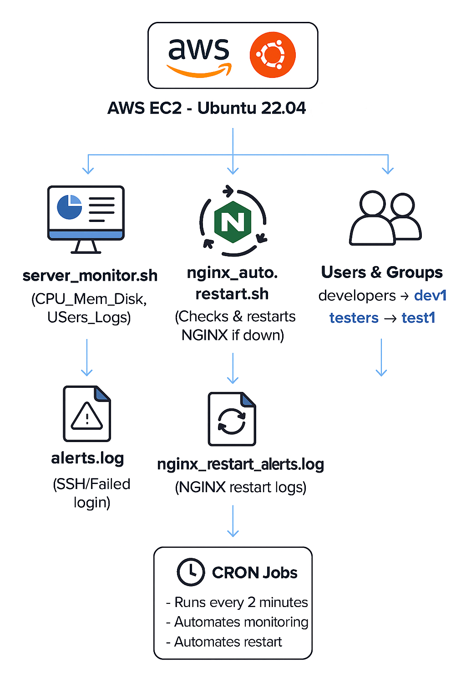  

---

## ⚙️ Scripts  

- `server_monitor.sh` → Monitors system metrics, SSH login failures, generates reports.  
- `nginx_auto_restart.sh` → Checks NGINX status and restarts automatically if down.  

---

## ☁️ Step 1: Launch EC2 & Connect  

- Launch **Ubuntu 22.04 LTS (t2.micro)** instance  
- Security Group → allow SSH(22), HTTP(80)  
- Connect using SSH
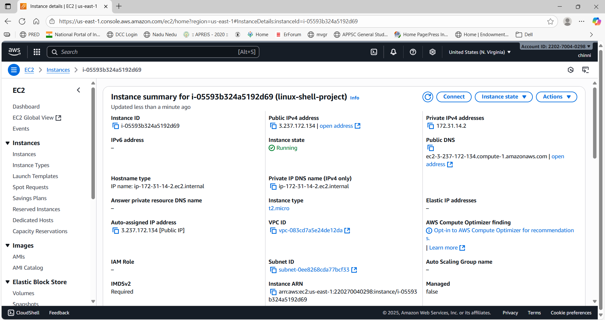
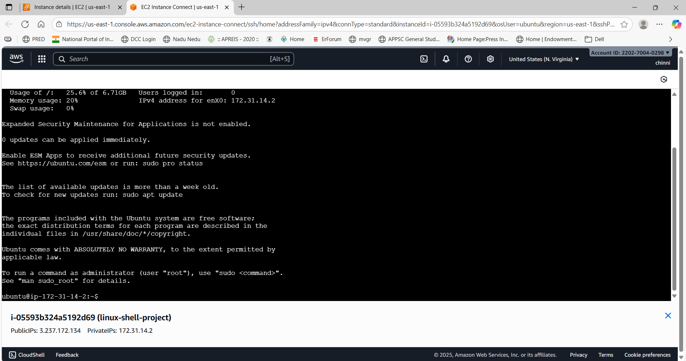

## Step 2: Linux Users & Groups Setup

This project also demonstrates **creating Linux users and groups**, which is essential for team-based DevOps workflows.

### 1. Create Groups
sudo groupadd developers
sudo groupadd testers
getent group developers → Verify group exists
getent group testers → Verify group exists

### 2. Create Users and Assign to Groups
#### Developer user
sudo useradd -m -s /bin/bash -G developers dev1
sudo passwd dev1                                              # set password
#### Tester user
sudo useradd -m -s /bin/bash -G testers test1
sudo passwd test1                                              # set password

### 3. Test Users
sudo su - dev1   # switch to dev1
whoami           # outputs: dev1
exit             # back to main user

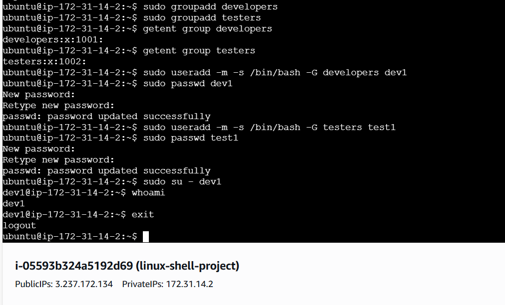

---

## 🖥️ Step 3: Manual Linux Audit
Run basic Linux commands to check system details.
### System Info 
uname -a && hostnamectl && uptime
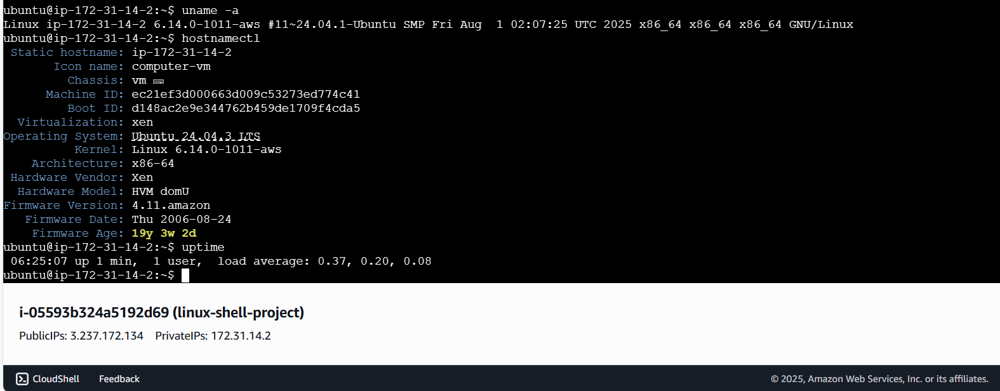

### CPU & Memory
top -b -n1 | head -15 && free -h && df -h && du -sh /home/*
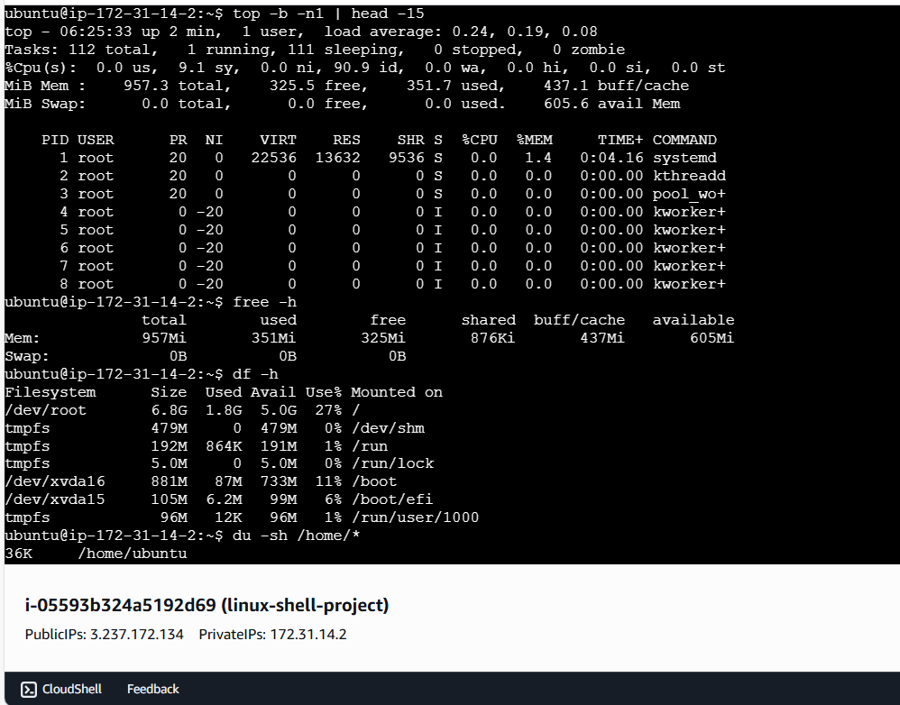

### Users & Groups
who && w && last && getent passwd 
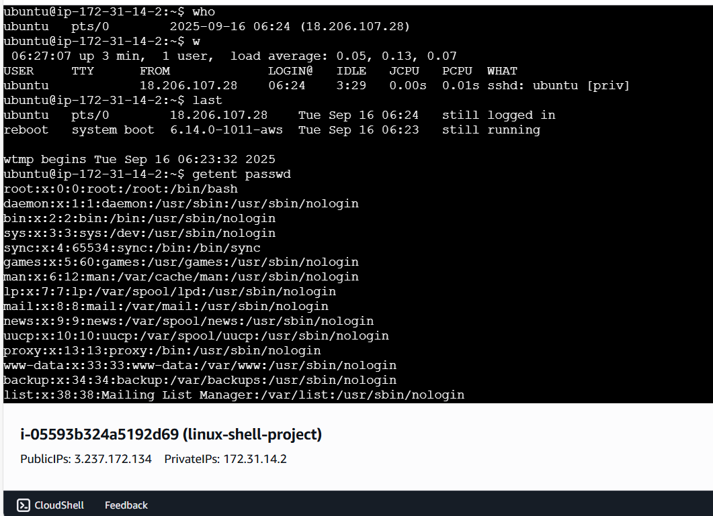
getent group
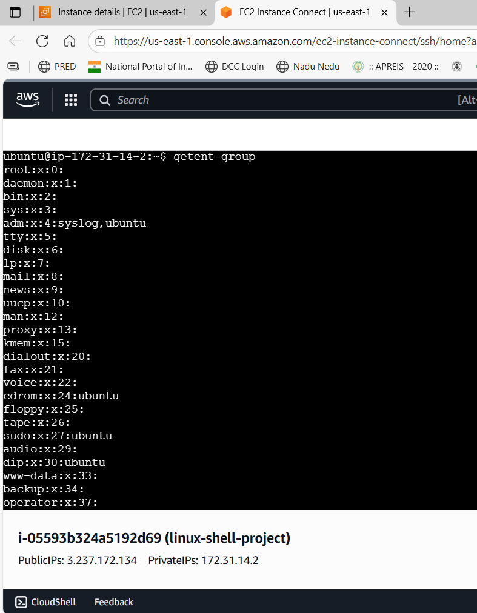

### Services & Processes
systemctl list-units --type=service --state=running
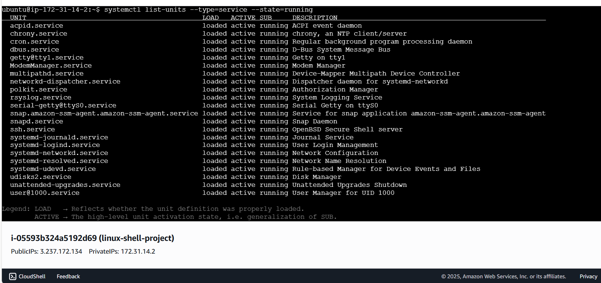
ps aux | sort -nrk 3 | head -10
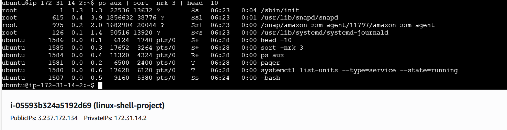

### Network
ss -tulnp && ip a && ping -c 3 google.com
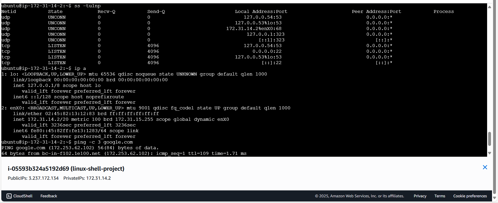

### File Permissions
ls -l /home && find /home -type f -perm /o+w && stat /etc/passwd
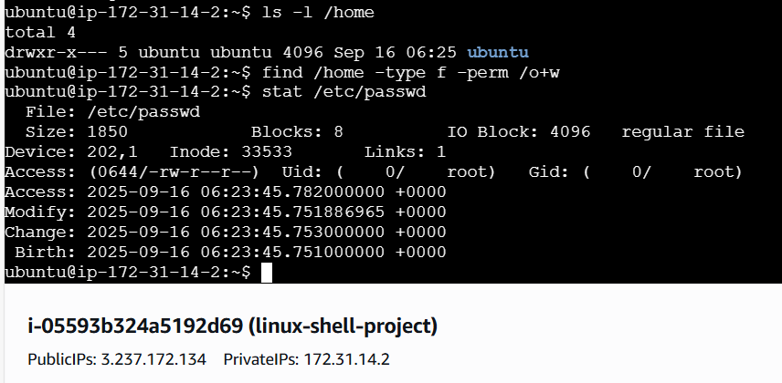

### Logs
tail -n 20 /var/log/auth.log
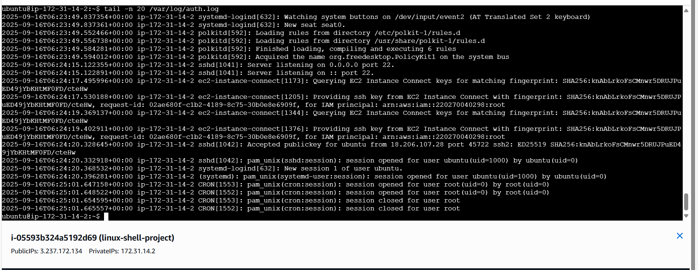
grep "Failed password" /var/log/auth.log && journalctl -xe | head -20
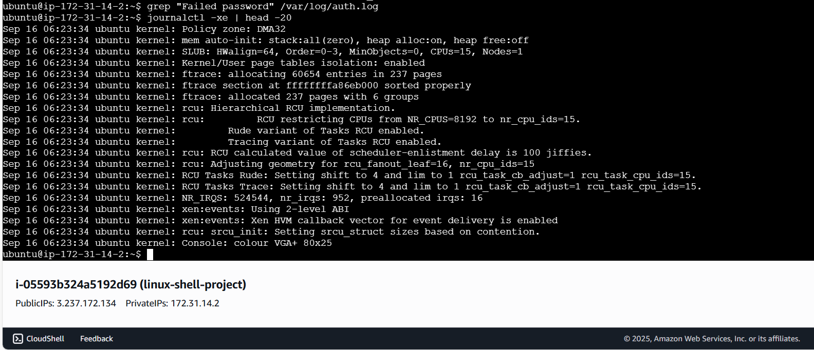

## 🔧 Step 3: Install & Monitor NGINX
Install NGINX
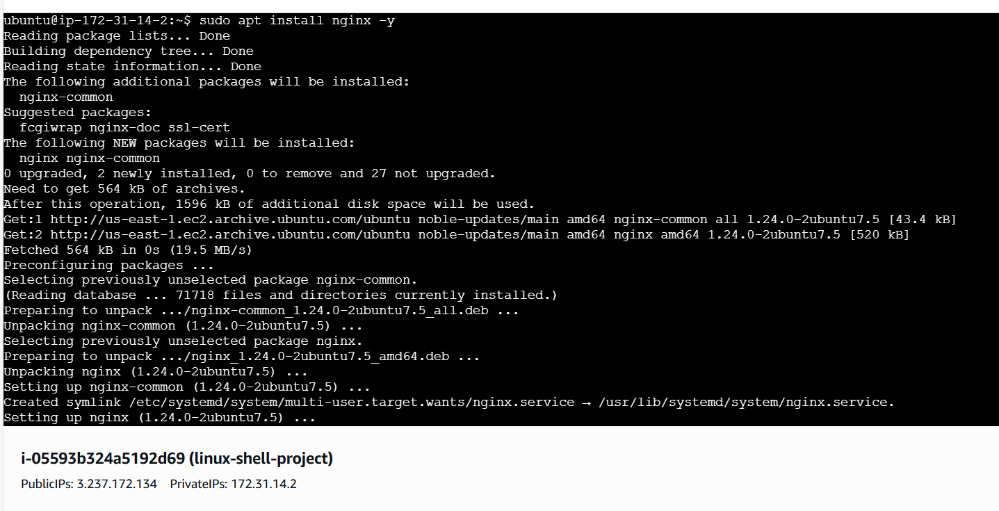
Verify active and stopped states
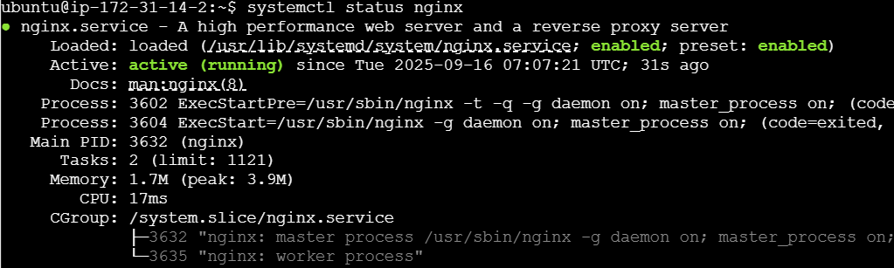

## ⏱️ Step 4: Bash Scripts
### server_monitor.sh
Monitors CPU, memory, disk usage
Checks logged-in users
Detects failed SSH login attempts
Saves report in /home/ubuntu/server_report_*.txt
Logs alerts in alerts.log
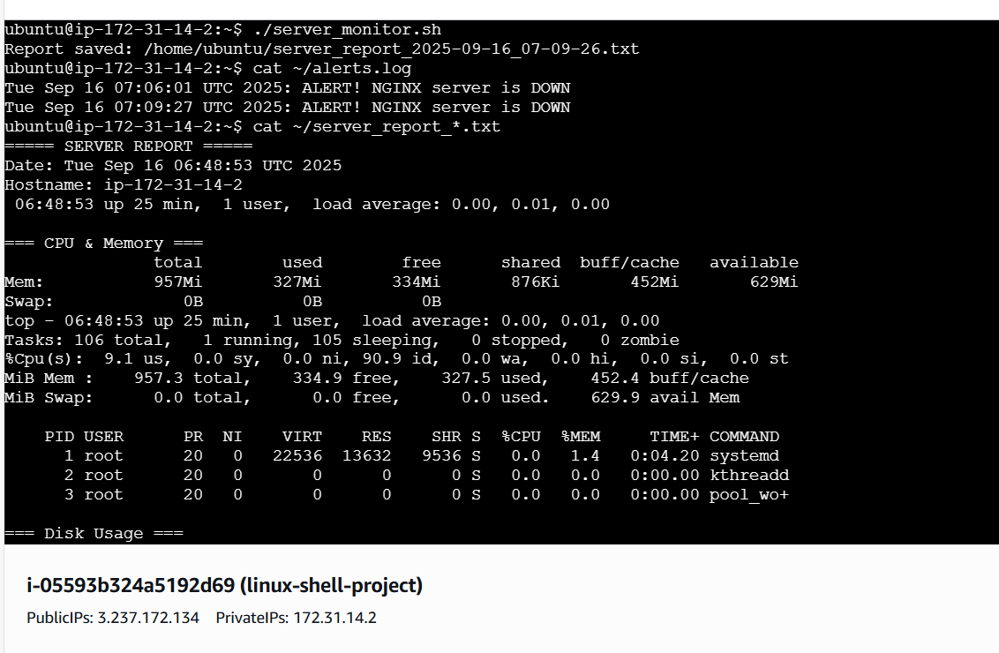
### nginx_auto_restart.sh
Checks if NGINX is running
Restarts NGINX if down
Logs actions in nginx_restart_alerts.log

## ⏱️ Step 5: Cron Job Setup
Automates running scripts every 2 minutes:
crontab -e
#### Add lines:
*/2 * * * * /home/ubuntu/server_monitor.sh >> /home/ubuntu/server_monitor_cron.log 2>&1
*/2 * * * * /home/ubuntu/nginx_auto_restart.sh >> /home/ubuntu/nginx_auto_restart_cron.log 2>&1
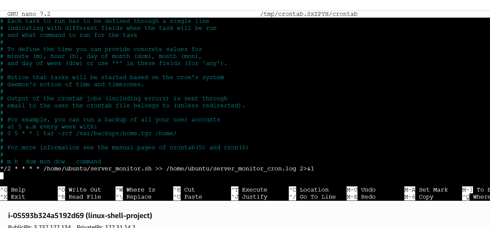
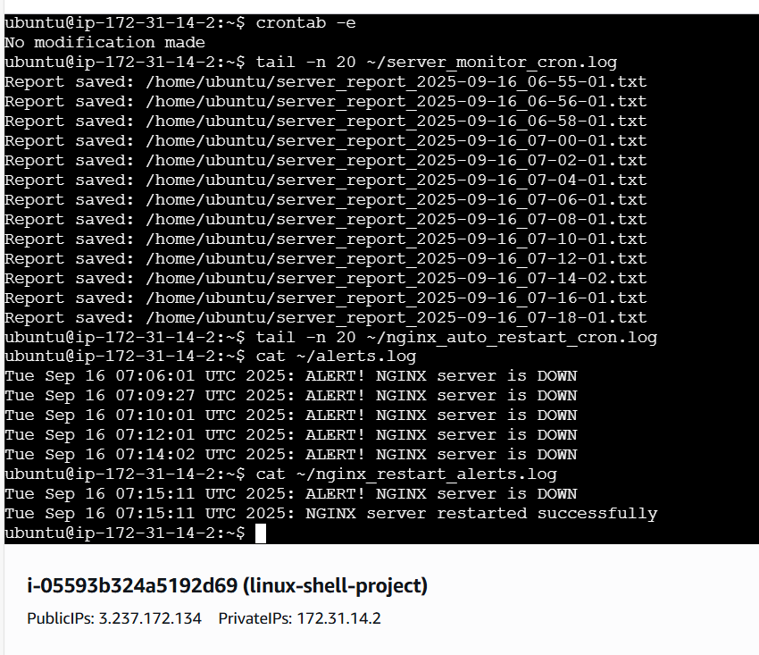

## Outcome
1. Automated Linux server monitoring and alerts
2. NGINX self-healing with auto-restart
3. Team-based Linux user/group setup demonstrating DevOps best practices
